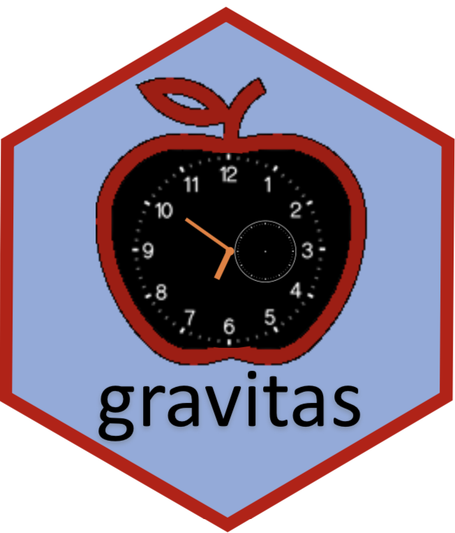

```{r setup, include=FALSE}
knitr::opts_chunk$set(echo = FALSE, message=FALSE, warning=FALSE, cache=TRUE,
  dev.args=list(bg=grey(0.9), pointsize=11))

knitr::read_chunk('R/main.R') 
knitr::read_chunk('R/theme.R')
```

```{r titleslide, child="components/titleslide.Rmd"}
```

---
class: center


```{r load}

```

.animated.bounce[

]

Visualizing probability distributions across bivariate cyclic temporal granularities

---

class: top left 

# Refresher slide: linear to cyclic

.pull-left[
.checked[
.smaller[
- **Cyclic time granularities:** exploring different periodicities e.g. hour-of-day, day-of-month or  hour-of-week, day-of-semester

- **Multiple observations for each level of cyclic granularity**

- summarize distribution of measured variables
]
]
]

.pull-right[
```{r linear2cyclic, animation.hook="gifski"}
0
```
]
---
class: top left 

# Refresher slide: summarize distribution

.pull-left[
.checked[
.smaller[
- **Cyclic time granularities:** exploring different periodicities e.g. hour-of-day, day-of-month or  hour-of-week, day-of-semester

- Multiple observations for each level of cyclic granularity

- **summarize distribution of measured variables**
]
]
]

.pull-right[
```{r allplot, animation.hook="gifski"}

```
]
---
class: top left

# Refresher slide: data structure and graphical mapping

.left-column[
<br>
<br>
-  extension of tsibble data structure
-  choose any two cyclic granularities: 
$C_i = \{A_1, A_2, \dots, A_K\}$ and $C_j = \{B_1, B_2, \dots, B_L\}$
- graphical mapping $(C_i, C_j, v)$

- ${N_C \choose 2}$ displays
]

.right-column[

```{r graphical map, out.width="90%"}

```

]
---
class:left, top

# Refresher slide: Relationship of cyclic granularities

.pull-left[
**<span style="color:firebrick"> <i> Clashes</i>:** pairs leading to empty sets

```{r clash, out.width="100%"}
```

]

.pull-right[
**<span style="color:firebrick"> <i> Harmonies</i>:** pairs leading to no empty sets


```{r noclash, out.width="100%"}
```
]

Still too many harmonies for display for large $N_C$
---
class: top left 

# Rank them up! Most to least interesting

.pull-left[
```{r question1, out.width="100%"}
```
]

.pull-right[
```{r question2, out.width="100%"}
```
]

```{r countdown}

```


---
class: top left 

# Ranking rationale?

.pull-left[
```{r question3, out.width="100%"}
```
]

.pull-right[
```{r question4, out.width="100%"}
```
]

```{r countdown2}
```


---

# Formulating ideas 

## What did you look at?

 * Gestalt theory
 * within group variation?  (**maximum pairwise dissimilarity ordered/unordered** across x-axis labels)
 * between group variation? (highest **average** within group variation over facets)
 * higher number of levels? (choosing **normalization**)
 * Are the variations "significant" enough to be interesting? (choosing **threshold**)

---
class: top left

# Median Maximum Pairwise Distance (MMPD)

$$\frac{median_{k \in \{1, 2, \ldots, K\}}(\operatorname*{max}_{s, t \in \{1, 2, \ldots, L\}}(\frac{JSD(p_s, p_t) - a_k}{b_k})}{log(K)}$$

- JSD is the Jensen-Shannon distances between probability distribution $p_s$
and $p_t$ of the $s^{th}$ and $t^{th}$ x-axis category 
- $a_k$ and $b_k$ are
the normalizing constants for the maximum pairwise distance of the $k^{th}$ facet category
- The thresholds are chosen using ordered permutation tests.


---
class: top left


# Results: Highest to lowest MMPD

```{r rank harmony}

```

---
class: top left


# Results: Highest to lowest MMPD

```{r ranking disclosed, out.width="90%"}

```

---
class: top left


# Results: Highest to lowest MMPD

```{r threshold, out.width="100%"}

```

---
class: top left


# Results: Highest to lowest MMPD

```{r normalization, out.width="100%"}

```
---
class: middle center

# More Information

Slides: https://sayanigupta-numbats.netlify.com/   

Materials: https://github.com/Sayani07/NUMBATS2020 

Slides created with <i> Rmarkdown, knitr, xaringan, xaringanthemer</i>

## Thank you
